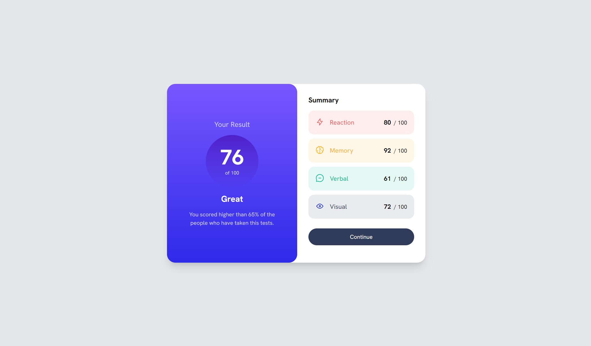
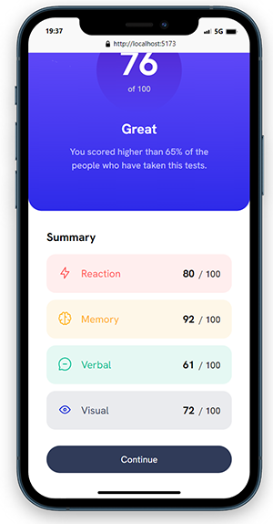

# Frontend Mentor - Results summary component solution

This is a solution to the [Results summary component challenge on Frontend Mentor](https://www.frontendmentor.io/challenges/results-summary-component-CE_K6s0maV).  

## Table of contents

- [Overview](#overview)
  - [The challenge](#the-challenge)
  - [Screenshot](#screenshot)
  - [Links](#links)
- [My process](#my-process)
  - [Built with](#built-with)
  - [What I learned](#what-i-learned)
- [Author](#author)

## Overview

### The challenge

Users should be able to:

- View the optimal layout for the interface depending on their device's screen size. (Mobile and desktop)
- See hover states for the "Continue button"

### Screenshot

### Links

- Solution URL: [Github Repo](https://github.com/diegopaff/Frontend-Mentor_ch_02)
- Live Site URL: [Live Site at Netlify](https://frontendchallenge2.netlify.app/)

## My process

### Built with

- [React](https://reactjs.org/) - JS library
- CSS custom properties
- Tailwind CSS
- Mobile-first workflow
- Netlify (for free hosting)

### What I learned

In this project i learned responsive design using Tailwind CSS. 
This is the second challenge i take and i want to already start using a JS library as React, and to speed the styling i get started with my first ever project in tailwind CSS. I learn how to add a custom font into the tailwind dependencies and also run into a problem that Tailwind CSS do no support the hsla color format using the custom color class like bg-[hsla color here], so i tried to convert the colors to HSLW but the final result was a little bit diferent of the guide. The style guide provided by Frontend Mentor only have the colors en hsla format, so i finally decided to make custom classes in CSS and use they combined with the Tailwind utilities classes. 

The other problem that i encounter was that in the moment of hosting the website the svg files did not load. So i tried to find a free host for svg images but failed in the attempt, i finally have to change the svg to png file and upload it to a free host for images.

Within the files that Frontend Mentor give to you there is a data.json that contains the info of the 4 categories, so i map this data and pass each object as a prop to a new component that depending of the category applies diferent color scheme. 

## Author

- Website - [Diego Curutchet portfolio](https://diegocurutchetdev.netlify.app/)
- Frontend Mentor - [@diegopaff](https://www.frontendmentor.io/profile/diegopaff)
- Github - [Github](https://github.com/diegopaff)

